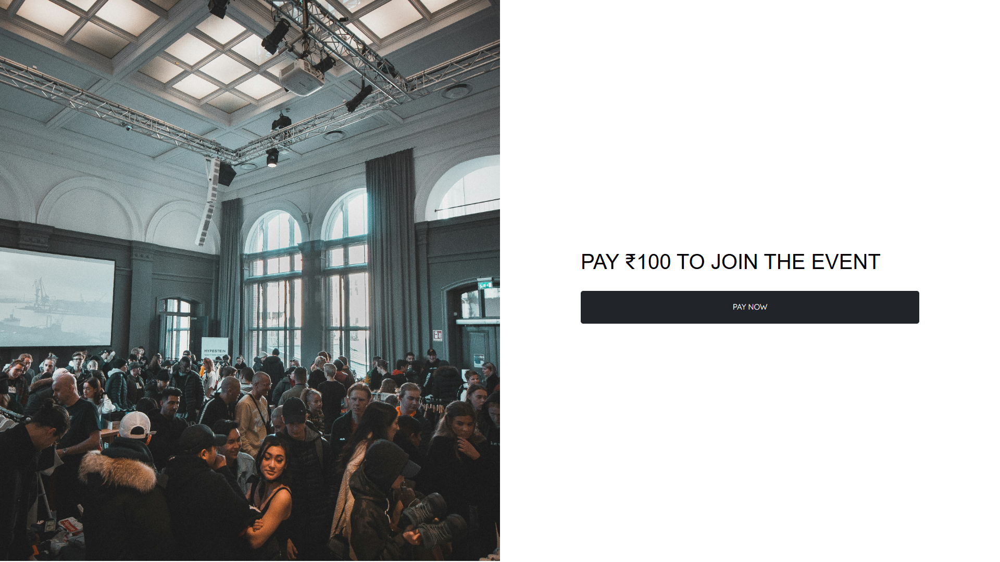
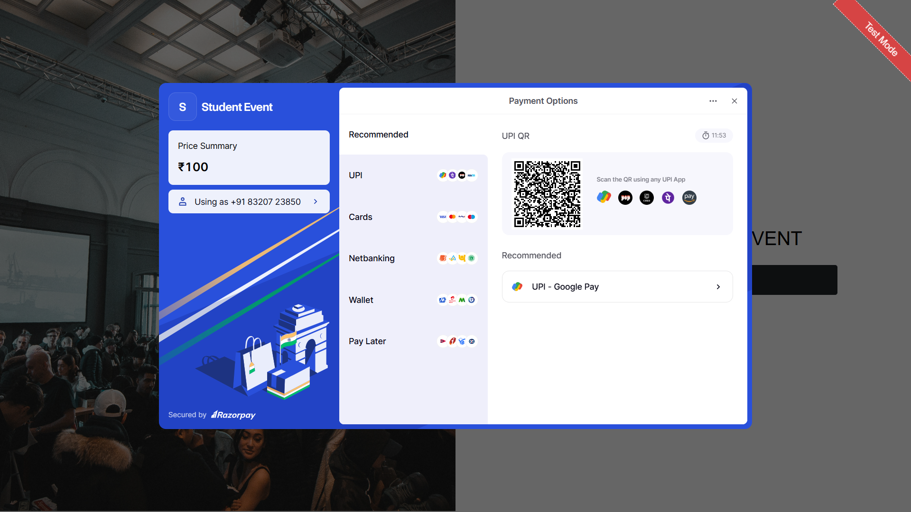
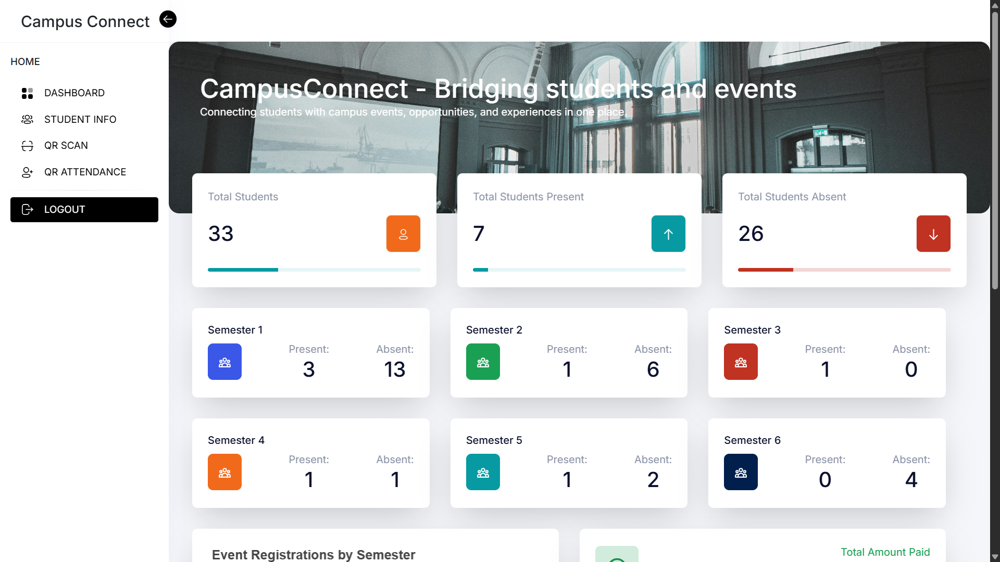
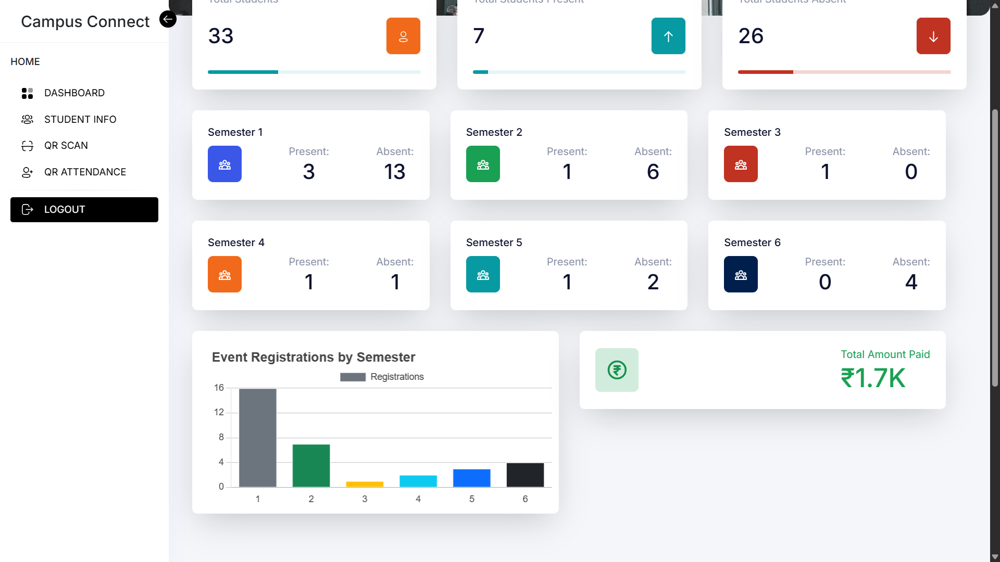
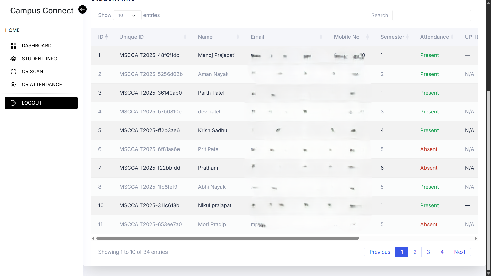
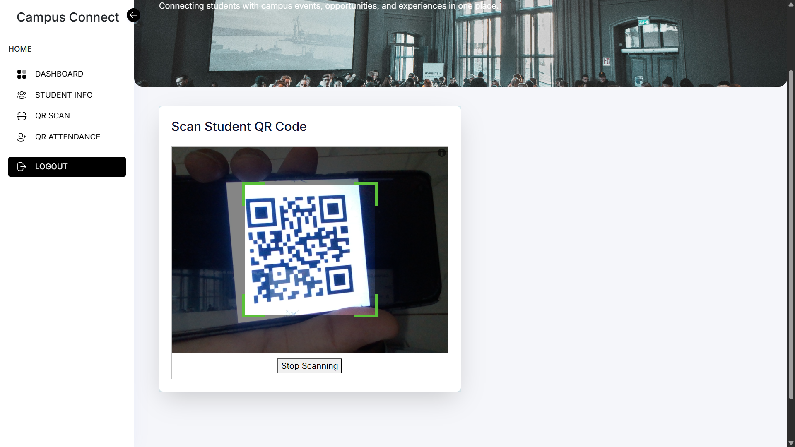
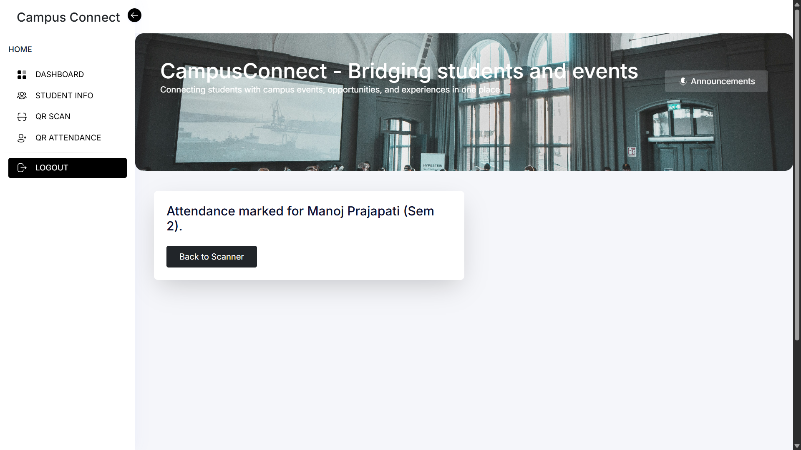

# 🎓 Student Event Registration & QR Attendance System

A **full-stack Flask web application** for managing student event registrations with **Razorpay payment integration**, **QR-based attendance**, **WhatsApp & Email confirmations**, and **exportable CSV records**.

---

## 📋 Features

- 📝 **Semester-based student registration** (Sem 1 free, Sem 2–6 paid ₹100)
- 💳 **Razorpay integration** for payment collection
- 📄 **Auto-generated PDF confirmation** with QR code
- 📷 **QR code scan** for attendance verification (with camera)
- 📤 **Export attendance & registration data** to CSV
- 🔐 **Admin login** with secure dashboard
- 📊 **Live statistics** for attendance & semester breakdown
- 📧 **Email confirmation** to registered students
- 📱 **WhatsApp confirmation** using Twilio API
- 🔍 **Duplicate registration prevention** (by email or mobile number)
- 📈 **Charts & dashboard** for admin analytics

---

## 🚀 Tech Stack

- **Frontend**: HTML, CSS, JavaScript  
- **Backend**: Python, Flask  
- **Database**: SQLite  
- **Payments**: Razorpay API  
- **QR Code**: `qrcode` Python module  
- **PDF Generation**: ReportLab  
- **Scanner**: `html5-qrcode` JavaScript library  
- **Messaging**: Flask-Mail (Email), Twilio WhatsApp API  
- **Data Export**: CSV with `pandas`

---

## 🖼️ Screenshots

- 
- 
- 
- 
- 
- 
- 
- 
- 

---

## 🛠️ Setup Instructions

<details>
<summary>📦 Click to Expand Setup Guide</summary>

### 1️⃣ Clone the Repository

```bash
git clone https://github.com/your-username/student-event-registration.git
cd student-event-registration
```

### 2️⃣ Create Virtual Environment

```bash
python -m venv venv
source venv/bin/activate  # On Windows: venv\Scripts\activate
```

### 3️⃣ Install Dependencies

```bash
pip install -r requirements.txt
```

### 4️⃣ Configure Environment Variables

Create a `.env` file:

```env
SECRET_KEY=your_secret_key

# Razorpay
RAZORPAY_KEY_ID=your_key_id
RAZORPAY_KEY_SECRET=your_key_secret

# Email (Flask-Mail)
MAIL_USERNAME=your_email@gmail.com
MAIL_PASSWORD=your_email_password
MAIL_DEFAULT_SENDER=your_email@gmail.com

# Twilio WhatsApp
TWILIO_SID=your_twilio_sid
TWILIO_AUTH_TOKEN=your_twilio_auth_token
TWILIO_WHATSAPP=whatsapp:+14155238886
```

### 5️⃣ Run the App

```bash
python app.py
```

The app will be live at:  
[http://localhost:5000](http://localhost:5000)

</details>

---

## 📂 Folder Structure

```bash
student-event-registration/
│
├── app.py
├── templates/
│   ├── register.html
│   ├── payment.html
│   ├── success.html
│   ├── scanner.html
│   ├── scan.html
│   ├── admin_login.html
│   ├── admin_panel.html
│   ├── admin_dashboard.html
│   └── verify.html
├── static/
│   ├── css/
│   │   └── style.css
│   ├── qr_codes/
│   ├── pdfs/
│   └── csv_exports/
├── database.db
├── .env
└── requirements.txt
```

---

## 📌 Core Functionalities

- ✅ Semester-based event registration (Sem 1 free, Sem 2–6 paid ₹100)  
- ✅ Duplicate prevention (email & mobile)  
- ✅ Razorpay payment flow  
- ✅ PDF + QR code generation for each registration  
- ✅ WhatsApp & Email confirmation after successful registration/payment  
- ✅ Admin QR scan to approve attendance  
- ✅ CSV export of all registrations and attendance  
- ✅ Attendance & payment analytics in dashboard  

---

## ✨ Future Enhancements

- 📤 **Google Sheets sync** for auto-updating records  
- 🌙 **Dark/Light mode** toggle for dashboard  
- 📧 **Bulk email reminders** to students  
- 📍 **Multiple event support** with separate tracking  

---

## 📜 License

This project is licensed under the **MIT License**.

---

## 🙌 Acknowledgements

- [Razorpay](https://razorpay.com/)  
- [html5-qrcode](https://github.com/mebjas/html5-qrcode)  
- [Flask](https://flask.palletsprojects.com/)  
- [Twilio](https://www.twilio.com/)  

---

## 📧 Contact

For queries, contact: **codinggujarat@gmail.com**
