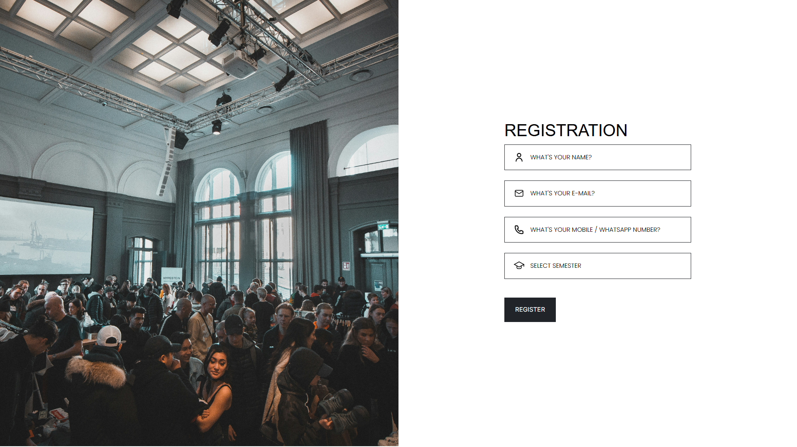

```md
# 🎓 Student Event Registration & QR Attendance System

A full-stack Flask web application for managing student event registration with payment gateway integration, QR-based attendance approval, and downloadable PDF confirmation.

---

## 📋 Features

- 📝 Student registration form by semester
- 💳 Razorpay integration for event fee payment
- 📄 Auto-generated PDF confirmation with QR code
- 📷 QR code scan for attendance approval (with camera)
- 🔍 Admin dashboard to verify and export attendance
- 📤 Export attendance records to CSV
- 🔐 Admin login for approval and security

---

## 🚀 Tech Stack

- **Frontend**: HTML, CSS, JavaScript
- **Backend**: Python, Flask
- **Database**: SQLite
- **Payments**: Razorpay API
- **QR Code**: `qrcode` Python module
- **PDF Generation**: ReportLab
- **Scanner**: `html5-qrcode` JavaScript library

---

## 🖼️ Screenshots

> Replace these with real screenshots later:

- 
- 
- 

---

## 🛠️ Setup Instructions

<details>
<summary>📦 Click to Expand Setup Guide</summary>

### 1. Clone the Repo

```bash
git clone https://github.com/your-username/student-event-registration.git
cd student-event-registration
```

### 2. Create Virtual Environment

```bash
python -m venv venv
source venv/bin/activate  # On Windows: venv\Scripts\activate
```

### 3. Install Dependencies

```bash
pip install -r requirements.txt
```

### 4. Configure Environment Variables

Create a `.env` file and add your Razorpay credentials:

```env
RAZORPAY_KEY=your_razorpay_key
RAZORPAY_SECRET=your_razorpay_secret
```

### 5. Run the App

```bash
python app.py
```

The app will be live at: [http://localhost:5000](http://localhost:5000)

</details>

---

## 📂 Folder Structure

```bash
student-event-registration/
│
├── app.py
├── templates/
│   ├── register.html
│   ├── payment.html
│   ├── success.html
│   ├── scanner.html
│   └── admin.html
├── static/
│   └── css/
│       └── style.css
├── database.db
├── .env
└── requirements.txt
```

---

## 📌 Core Functionalities

- ✅ Semester-based event registration
- ✅ Razorpay payment flow
- ✅ PDF + QR code generation
- ✅ Admin QR scan to approve attendance
- ✅ Export attendance list in `.csv` format

---

## ✨ Future Enhancements

- Email confirmation after payment
- Multi-event support
- Dark/light theme toggle
- Google Sheets sync

---

## 📜 License

This project is licensed under the **MIT License**.

---

## 🙌 Acknowledgements

- [Razorpay](https://razorpay.com/)
- [html5-qrcode](https://github.com/mebjas/html5-qrcode)
- [Flask](https://flask.palletsprojects.com/)

---

## 📧 Contact

For queries, contact: **codinggujarat@gmail.com**
```
